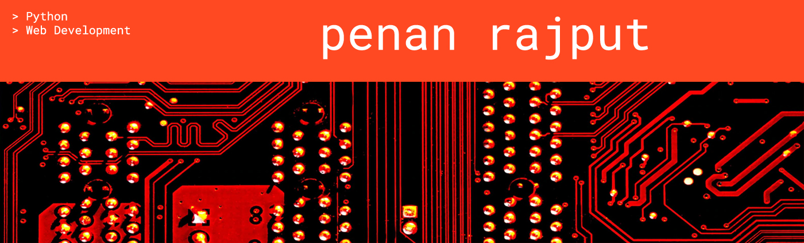

## Hi there 

I am **Penan Rajput** working as **Associate Software Engineer @ Tech Mahindra**. I am an Beginner Fullstack Developer with working in the information technology and services industry. **Skilled in C++, Java, Python**. Strong engineering professional with a Bachelor of Technology focused in Computer Science And Engineering from Dr. Babasaheb Ambedkar Technological University, Lonere – Full Time.

Visit My GitHub Repositories.

---

- 💼 I’m currently working as **Associate Software Engineer @ Tech Mahindra** 
- 📖 I’m currently learning **MEAN stack** 
- 👯 I’m looking to collaborate on open source/commercial projects 
- 💬 Ask me about **Software Development** 
- 📫 How to reach me: [LinkedIn](https://www.linkedin.com/in/penanrajput/), [Instagram](https://www.instagram.com/penan_rajput/) 

---
Learning Repositories

* [Programming Basics 🔰](domains/basics/basics.md)
* [Data Structures and Algorithms 💓](domains/ds_algo/ds_algo.md)
* [Web Programming 🎨](domains/web/readme.md)
* [Shell Scripting 🤩]()
* [Python 🐍](domains\python\python.md)
* [Cloud Computing ⛅]()
* [Agile & Scrum 🧐]()
* [Software Testing 🧪]()

🔗 &nbsp;**Connect with me**

  
<b>✨&nbsp;&nbsp;About&nbsp;Me</b>

   

I am a Associate Software Engineer in developing enterprise applications and open-source software.

 

  
<b>🛠️&nbsp;&nbsp;Languages&nbsp;and&nbsp;Tools</b>

   
  
 
     
      
        
     
     
     
    
     
     
     
     
     
     
     

